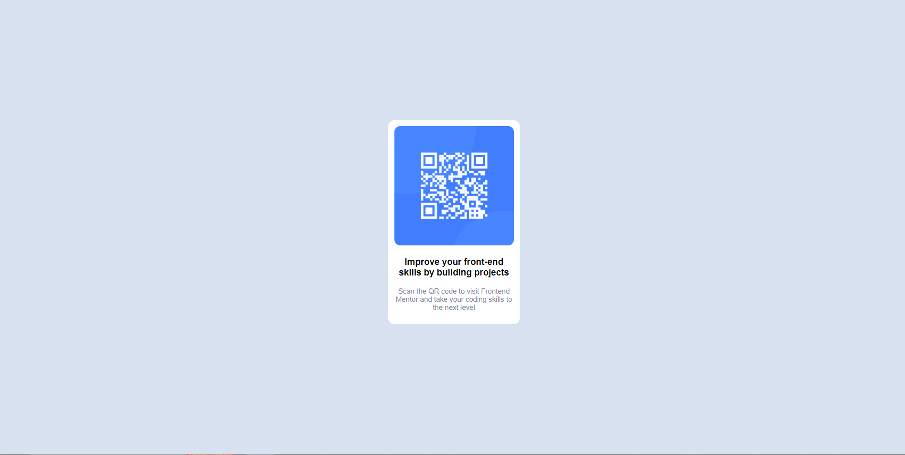

# Frontend Mentor - QR code component solution

This is a solution to the [QR code component challenge on Frontend Mentor](https://www.frontendmentor.io/challenges/qr-code-component-iux_sIO_H). Frontend Mentor challenges help you improve your coding skills by building realistic projects. 

## Table of contents

- [Overview](#overview)
  - [Screenshot](#screenshot)
  - [Links](#links)
- [My process](#my-process)
  - [Built with](#built-with)
  - [What I learned](#what-i-learned)
  - [Continued development](#continued-development)
  - [Useful resources](#useful-resources)
- [Author](#author)
- [Acknowledgments](#acknowledgments)

**Note: Delete this note and update the table of contents based on what sections you keep.**

## Overview

### Screenshot



### Links

- Solution URL: [https://github.com/sanijcreates/qr-code-component](https://your-solution-url.com)
- Live Site URL: [https://sanijcreates.github.io/qr-code-component/](https://your-live-site-url.com)

## My process

### Built with

- Semantic HTML5 markup
- CSS custom properties
- Flexbox

**Note: These are just examples. Delete this note and replace the list above with your own choices**

### What I learned
- Flexbox
- Centering containers vertically and horizontally

```css
.main-container {
    height: 100vh;
    display: flex;
    flex-direction: column;
    align-items: center;
    justify-content: center;
}
.qr-container {
    border-radius: 10px;
    background-color: #ffffff;
    width: 200px;
    padding: 10px;
    text-align: center;
    box-shadow: 5px 5px 20px hsl(212, 45%, 89%);
}
```

### Continued development

## Author

- Website - [Add your name here](https://www.your-site.com)
- Frontend Mentor - [@yourusername](https://www.frontendmentor.io/profile/yourusername)
- Twitter - [@yourusername](https://www.twitter.com/yourusername)

**Note: Delete this note and add/remove/edit lines above based on what links you'd like to share.**